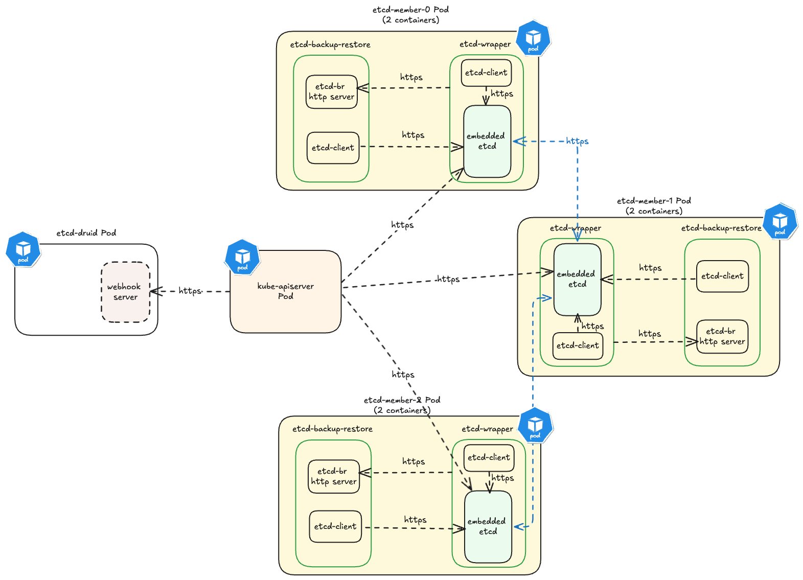

# Securing etcd cluster

This document will describe all the TLS artifacts that are typically generated for setting up etcd-druid and etcd clusters in Gardener clusters. You can take inspiration from this and decide which communication lines are essential to be TLS enabled.

## Communication lines

In order to undertand all the TLS artifacts that are required to setup etcd-druid and one or more etcd-clusters, one must have a clear view of all the communication channels that needs to be protected via TLS. In the diagram below all communication lines in a typical 3-node etcd cluster along with `kube-apiserver` and `etcd-druid` is illustrated.

> **Note:** For [Gardener](https://github.com/gardener/gardener) setup all the communication lines are TLS enabled. 

## TLS artifacts

